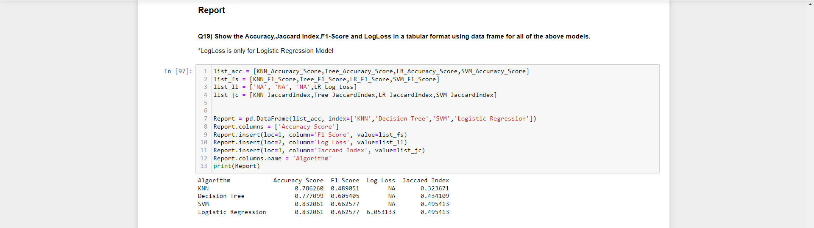

# Classification with Python

## About the Data

The dataset used in this project contains weather observations from the Australian Government's Bureau of Meteorology. It includes data from 2008 to 2017 with additional columns such as 'RainToday' and 'RainTomorrow', obtained from the Rattle Data Repository. The target variable for classification is 'RainTomorrow', indicating whether it will rain the next day.

## Import the Required Libraries

This section imports necessary libraries such as pandas for data manipulation, scikit-learn for machine learning algorithms, and various metrics for model evaluation.

## Importing the Dataset

The dataset is imported from a cloud storage link using pandas' `read_csv` function.

## Data Preprocessing

### One Hot Encoding

Categorical variables are encoded using one-hot encoding for better compatibility with machine learning algorithms.

### Training Data and Test Data

The dataset is split into features and target variables, and further divided into training and testing sets.

## Model Implementation

### Linear Regression

A linear regression model is trained and evaluated using mean absolute error, mean squared error, and R-squared metrics.

### KNN (K-Nearest Neighbors)

A KNN classifier is trained and evaluated using accuracy score, Jaccard index, and F1 score.

### Decision Tree

A decision tree classifier is trained and evaluated using the same metrics as KNN.

### Logistic Regression

A logistic regression model is trained and evaluated using accuracy score, Jaccard index, F1 score, and log loss.

### SVM (Support Vector Machine)

An SVM classifier is trained and evaluated using accuracy score, Jaccard index, and F1 score.

## Report

The performance of each model is summarized in a tabular report, including accuracy score, F1 score, log loss (if applicable), and Jaccard index. Additionally, a visualization of the report is provided in the form of a table.

